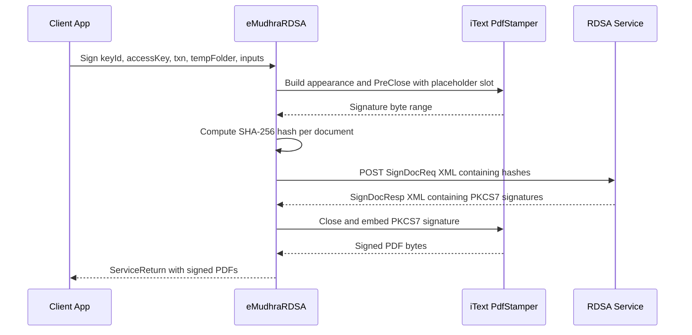

# eMudhra RDSA — Remote Document Signing Library

[](LICENSE)
[](https://dotnet.microsoft.com/download/dotnet-framework/net48)

`eMudhraRDSA` is a .NET Framework class library for applying digital signatures
to PDF documents **without the client ever holding the signing private key**.
The library prepares the PDF locally, sends only the document hash to a remote
signing service, and embeds the returned PKCS#7 signature back into the PDF.

This is the standard pattern for hash-based remote signing: the private key
stays on the server, and only hashes and signatures cross the network.

> ⚠️ **Licensing:** this repository bundles iText 5 (AGPL-3.0) as its PDF
> engine, so the project as a whole is distributed under the **AGPL-3.0**. The
> original code in `RDSA/` is additionally available under the MIT license. See
> [Licensing](#licensing) before using or redistributing.

---

## Features

Signature appearance is selected per document via `AppearanceType`:

| Appearance | Description |
|------------|-------------|
| `Standard` | Name, reason, location, and timestamp block. |
| `OneLiner` | A single line of text. |
| `CustomContent` | Arbitrary caller-supplied text. |
| `SignatureImage` | A signature image, optionally beside descriptive text. |
| `Advanced` | Background image plus left- and right-side text. |

Additional capabilities: predefined or page-level coordinate placement, signing
specific/first/last/odd/even/all pages, content-search placement (anchor the
signature next to matching text), validation tick mark, certification level,
custom font color, and optional border.

## Requirements

- .NET Framework **4.8**
- Visual Studio 2022 / MSBuild
- Network access to an RDSA signing service endpoint, plus credentials
  (`ClientId`, `KeyID`, `AccessKey`) issued by the service operator.

## Build

```powershell
msbuild eMudhraRDSA.sln /p:Configuration=Release
```

Output: `bin\Release\eMudhraRDSA.dll`. There is no test suite or executable; the
project is a class library consumed by referencing the produced DLL.

## Quick start

```csharp
using RDSA;
using System;
using System.Collections.Generic;
using System.IO;

// 1. Configure the signer (ClientId and service URL are issued to you).
var signer = new RemoteSigning(clientId, rdsaUrl);
// With an authenticated proxy:
// var signer = new RemoteSigning(clientId, rdsaUrl, true, proxyIp, proxyPort, proxyUser, proxyPass);

// 2. Describe each document to sign (fluent builder shown; constructors also exist).
RDSAInput input = RDSAInputBuilder.Init(pdfAsBase64)
    .SetAppearanceType(AppearanceType.Standard)
    .SetSignedBy("Jane Doe")
    .SetReason("Approved")
    .SetLocation("Bengaluru")
    .SetPageTobeSigned(Page.FIRST)
    .SetCoordinates(Coordinates.Bottom_Right)
    .SetTickRequired(true)
    .Build();

// 3. Sign (up to 10 documents per call).
ServiceReturn result = signer.Sign(
    keyId, accessKey, transactionId, tempFolder,
    new List<RDSAInput> { input });

// 4. Handle the result — errors are returned, not thrown.
if (result.ReturnStatus == Status.Success)
{
    foreach (ReturnDocument doc in result.ReturnDocuments)
    {
        if (doc.SignedStatus == Status.Success)
            File.WriteAllBytes($"signed_{doc.DocId}.pdf",
                Convert.FromBase64String(doc.SignedDocument));
        else
            Console.WriteLine($"Doc {doc.DocId}: {doc.ErrorCode} {doc.ErrorMessage}");
    }
}
else
{
    Console.WriteLine($"{result.ErrorCode}: {result.ErrorMessage}");
}
```

`tempFolder` must be writable; the library writes intermediate PDFs there as
`{transactionId}_{docId}.pdf` and reads them back after signing. It is not
auto-cleaned.

## How signing works

The `Sign` call is a two-phase, detached-signature handshake. The client hashes
the prepared PDF, the remote service signs the hash, and the client embeds the
returned signature.



The request XML is authenticated with
`accessKeyhash = SHA256(transactionId + accessKey + base64(docsXml))`; the raw
`AccessKey` is never transmitted.

## Error handling

`Sign` always returns a `ServiceReturn` and does not throw on expected failures.
Inspect `ReturnStatus`, and per-document `SignedStatus` / `ErrorCode` /
`ErrorMessage`. Common codes:

| Code | Meaning |
|------|---------|
| `RDSA-102` | `KeyID` or `AccessKey` missing. |
| `RDSA-103` | `Inputs` null, empty, or more than 10 documents. |
| `RDSA-104` | Temp folder path empty. |
| `RDSA-105` | Failed to create a document hash (per document). |
| `RDSA-106` | All documents failed hashing. |
| `RDSA-107` | Network error calling the signing service. |
| `RDSA-108` | Empty response from the service. |
| `RDSA-109` | Malformed response XML. |
| `RDSA-110` | No signature node in the response. |
| `RDSA-111` / `RDSA-112` | Document ID in the response could not be matched. |
| `RDSA-113` | Failed to embed the returned signature. |
| `RDSA-120` | Content-search text not found in the PDF. |
| `RDSA-999` | Unhandled error (see `ErrorMessage`). |

## Project layout

| Path | Contents |
|------|----------|
| `RDSA/` | The library's own code (public API, signing orchestration). |
| `eSign/` | Bundled iText 5 PDF engine (AGPL-3.0). |
| `BouncyCastle/` | Bundled Bouncy Castle crypto (MIT-style). |
| `System/util/` | Support utilities and zlib port used by the PDF engine. |

The public API surface is small: `RemoteSigning`, `RDSAInput` /
`RDSAInputBuilder`, the appearance helper types (`CustomStyle`,
`AdvanceSignature`, `ContentSearch`), the enums in `Enums.cs`, and the result
types `ServiceReturn` / `ReturnDocument`.

## Security note

`RDSAUtility.HttpsWebClientSendRequest` currently sets the TLS
`ServerCertificateValidationCallback` to always return `true`, disabling server
certificate validation. This is a known limitation retained for legacy server
compatibility. Review and harden this before using the library against an
untrusted network.

## Licensing

- **Repository as a whole:** GNU Affero General Public License v3.0 —
  [`LICENSE`](LICENSE). This is required because the bundled iText 5 PDF engine
  in `eSign/` is AGPL-3.0. AGPL Section 13 imposes a source-availability
  obligation even for network/server use.
- **Original `RDSA/` code:** additionally offered under the MIT license —
  [`LICENSE-MIT`](LICENSE-MIT).
- **Bundled third-party components and their licenses:**
  [`THIRD-PARTY-NOTICES.md`](THIRD-PARTY-NOTICES.md).

To redistribute under a permissive license, replace the AGPL iText 5 dependency
(or obtain a commercial iText license) as described in the notices file.

## Contributing

See [`CONTRIBUTING.md`](CONTRIBUTING.md).
